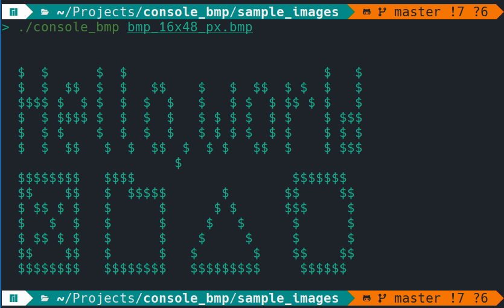
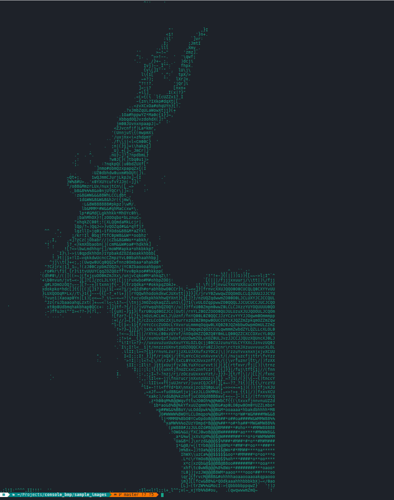
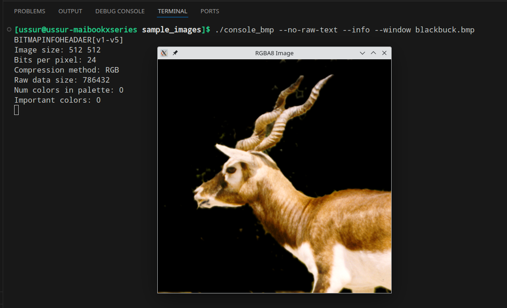

# console_bmp

Its a cross-platform CLI viewer for .bmp . Supports all uncompressed BMP types.

Entry point is `console_bmp/src/main.cpp`. The program is `build/bin/Debug/console_cpp.exe` (if MSBuild) or `build/bin/console_bmp.exe` (with other toolchains).

- `$ console_bmp sample_images/black_and_white_1_8x24_px.bmp`
    

- `$ console_bmp --gradient sample_images/blackbuck.bmp`:
    

## Building

Build is done with CMake:
```bash
$ git submodule update --init --recursive
$ cmake -S . -B build
$ cmake --build build --parallel
$ cd build/bin # Might be different with MSBuild
```

Building produces two executables: `console_bmp` and `run_tests`.
Use `run_tests` to check that program works correctly as expected.

You can specify cmake option `SFML_WINDOW_DISPLAY` to have a `--window` cli feature that opens image in a window.
Here is how it is used from CLI:


It is specified like this before build **(you have to have SFML installed)**:
```bash
$ cmake -S . -B build -DSFML_WINDOW_DISPLAY=ON
```

## Layout

- `console_bmp/` - the CLI app itself.
- `bmp_reader/` - library that abstract away parsing BMP files. Reads files via `std::istream&`.
- `tests/` - module that produces `run_tests.exe` to test correctness of the library.

## Usage

1. Just print whole image to terminal in 1-bit mode:
    ``` bash
    $ ./console_bmp sample_images/black_and_white_1_8x24_px.bmp 

    $$$$$$$$$$$$$$$$$ $$$$$$
    $ $$$$$$$$$$$$$$   $$ $$
    $ $$$$$$$$$$$$$ $ $ $ $$
    $ $$$ $$$$$$$$$$$ $ $$ $
    $   $     $   $$   $$$$ 
    $ $ $ $ $ $   $ $ $$$$ $
    $   $ $ $ $ $$$ $ $ $ $$
    $$$$$$$$$$$$$$$$   $$ $$
    ```

2. `--no-raw-text` - do not print image to terminal (used with other flags).
3. `--info`, `-i` - show info about image.
4. `-w`, `-h` - set MAXIMUM size of output image. 
    `-w` accepts maximum width in symbols, `-h` - maximum height.
5. `--no-auto-width` - do not restrict display area by terminal size.
6. `--gradient` - use more than two colors:

    `$ console_bmp --gradient sample_images/blackbuck.bmp`:
    

7. Build flag OPTIONAL: `--window`. Opens SFML window with specified image in rgba8 format. 